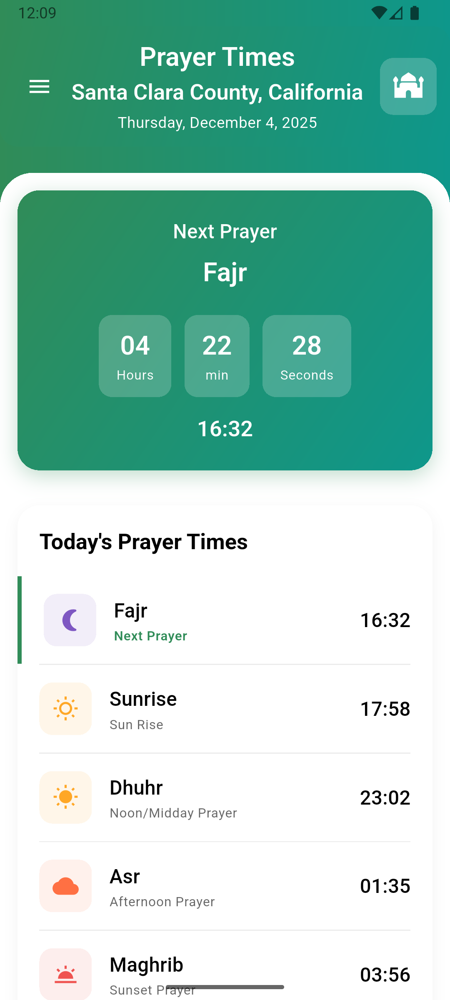
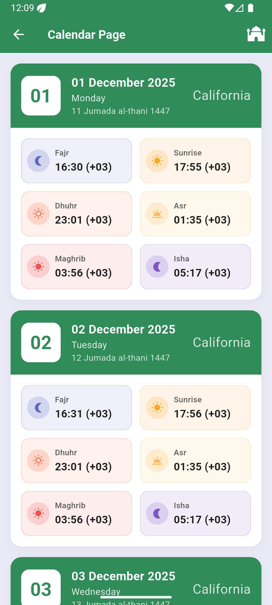
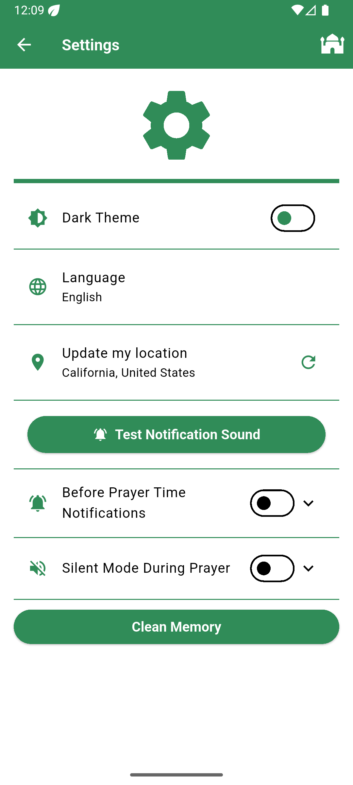
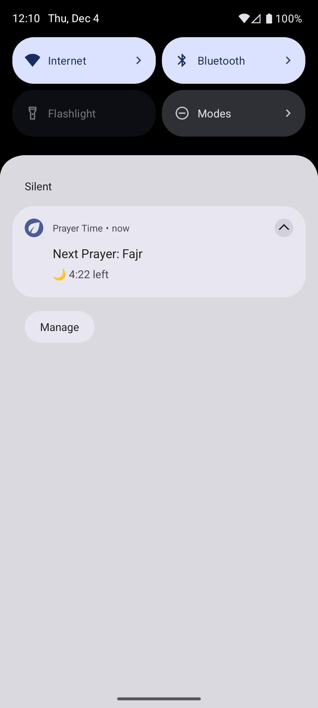
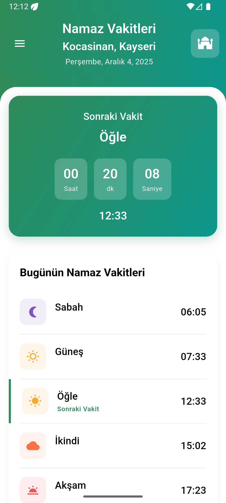
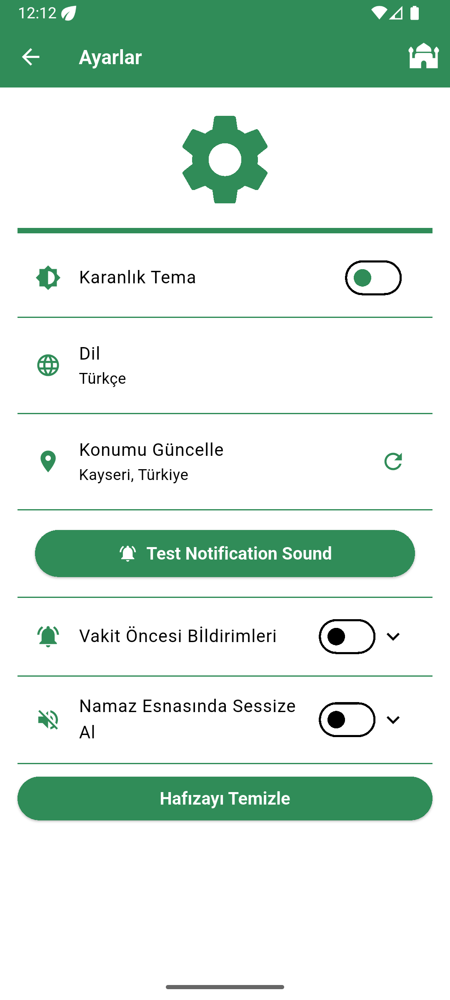
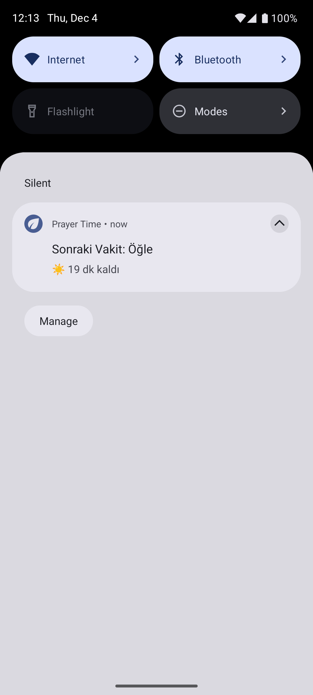

# 🕌 Prayer Time / Namaz Vakti

<div align="center">


**A beautiful and feature-rich prayer times application built with Flutter**

**Flutter ile geliştirilmiş, zengin özelliklere sahip namaz vakitleri uygulaması**

[English](#english) | [Türkçe](#turkish)

</div>

---

<a name="english"></a>
## 📖 English

### Overview
Prayer Time is a comprehensive mobile application that helps Muslims keep track of their daily prayer times. The app provides accurate prayer times based on your location, with notification support, automatic silent mode, and reliable background service.

### ✨ Features

#### 🕐 Prayer Times
- **Accurate Times**: Fetches prayer times based on your current location using Diyanet calculation method
- **Daily View**: Today's complete prayer schedule with countdown to next prayer
- **Weekly Calendar**: View prayer times for the entire week
- **Monthly Calendar**: Full month prayer times overview with Hijri calendar support
- **Automatic Updates**: Prayer times update automatically based on location changes
- **Offline Access**: Cached prayer times available even without internet connection

#### 🔔 Smart Notifications
- **Before Prayer Notifications**: Get notified before each prayer time (customizable from 5 to 60 minutes)
- **During Adhan Notifications**: Optional notifications at the exact prayer time
- **Individual Control**: Enable/disable notifications for each prayer separately (Fajr, Dhuhr, Asr, Maghrib, Isha)
- **Persistent Notification**: Always-on notification showing the next prayer time that **cannot be dismissed**
- **Background Service**: Runs reliably in the background for timely alerts with foreground service
- **Non-Dismissible Service**: Foreground service notification stays in the notification panel permanently
- **Universal Compatibility**: Works on all Android devices including Huawei/Honor
- **Customizable Notification Sounds**: Choose from 13 different notification sounds with localized names
- **Sound Preview**: Test notification sounds before applying them

#### 🔇 Automatic Silent Mode
- **Prayer Time Silence**: Automatically silence your phone during prayer times
- **Customizable Duration**: Set different durations before and after each prayer (5-120 minutes)
- **Individual Settings**: Configure silent mode for each prayer independently
- **Smart Automation**: Works seamlessly in the background without user intervention
- **DND Integration**: Uses Android's Do Not Disturb mode for reliable silent mode activation

#### 🌍 Location Services
- **Auto-Detection**: Automatically detects your location using GPS and network
- **Manual Refresh**: Update location whenever needed from settings
- **Cache System**: Stores prayer times for offline access
- **Location Change Detection**: Automatically updates prayer times when you move to a new location
- **Geocoding**: Shows your current city and district
- **Privacy**: Location data is only used for prayer time calculation

#### 🎨 User Interface
- **Modern Design**: Clean and intuitive material design
- **Dark Mode**: Eye-friendly dark theme support with automatic system theme detection
- **Bilingual**: Full support for English and Turkish with automatic language detection
- **Smooth Animations**: Beautiful transitions and animations
- **Responsive Layout**: Works perfectly on all screen sizes
- **Custom Fonts**: Uses Montserrat font family for better readability
- **Localized Sound Names**: Notification sound names displayed in user's language

#### ⚙️ Settings & Customization
- **Language Selection**: Switch between English and Turkish
- **Theme Selection**: Choose between light and dark modes or follow system theme
- **Battery Optimization**: Comprehensive guidance and automatic prompt for ensuring background service reliability
- **Cache Management**: Clear cached data when needed
- **Notification Settings**: Granular control over all notification preferences
- **Silent Mode Settings**: Detailed configuration for automatic silent mode
- **Sound Customization**: Select and preview from 13 different notification sounds

#### 🧭 Additional Features
- **Qibla Compass**: Find the direction to Kaaba with accurate compass
- **Hijri Calendar**: Shows Islamic calendar dates alongside Gregorian dates
- **Prayer Statistics**: Track your prayer times and habits
- **Multi-language Support**: English and Turkish with easy language switching

### 📱 Screenshots

<div align="center">
    
  
   
  <br /> 
      
  
</div>

### 🚀 Version History

#### Version 0.6.0 - Localization & Sound Enhancement 🔊
- **🌐 Localized Notification Sounds**: All 13 notification sound names now display in your selected language (English/Turkish)
- **🎵 Sound Preview Feature**: New "Play Sound" button allows you to test notification sounds before applying
- **🔊 Enhanced Sound Selection**: Improved dropdown menu with localized sound names for better user experience
- **🌍 Complete Localization**: Sound names automatically switch between English and Turkish based on app language
- **✨ Better UX**: More intuitive sound selection process with preview functionality
- **📱 Improved Settings**: Reorganized settings screen with better sound customization options

**Available Notification Sounds:**
- Flute / Flüt
- Flute 2 / Flüt 2
- Bicycle Ring / Bisiklet Zili
- Wolf Howling / Kurt Uluması
- Clear Tone / Berrak Ton
- Fire / Ateş
- Flute 3 / Flüt 3
- Harp / Arp
- Hawk / Şahin
- Positive Sound / Pozitif Ses
- Tick Tock Alarm / Tik Tak Alarm
- Tick Tock Alarm 2 / Tik Tak Alarm 2
- Wolf Pack Howling / Kurt Sürüsü Uluması

#### Version 0.5.6 - Silent Mode Permission Fix 🔧
- **🔧 Critical Fix**: Resolved missing permission request for silent mode activation
- **🔐 Permission Handling**: App now properly requests Do Not Disturb permission before enabling silent mode
- **✨ Improved UX**: Users are now prompted to grant necessary permissions when enabling automatic silent mode
- **🐛 Bug Fix**: Fixed issue where silent mode couldn't activate due to missing permission request
- **📱 Better Error Handling**: Enhanced permission flow with clear user guidance

#### Version 0.5.5 - Performance & Stability Update 🚀
- **⚡ Performance Improvements**: Enhanced app performance and reduced loading times
- **🐛 Bug Fixes**: Fixed various stability issues and edge cases
- **🔧 Code Optimization**: Improved code quality and maintainability
- **📱 Better Cache Management**: More efficient caching system for prayer times
- **🔄 Background Service Improvements**: More reliable background service operation

#### Version 0.5.4 - Huawei Device Fix 🔧
- **🔧 Critical Fix**: Resolved crash issue on Huawei and Honor devices
- **📱 Notification Icon Fix**: Fixed notification icon compatibility problem that caused crashes
- **✅ Universal Compatibility**: App now works smoothly on all Android devices including Huawei/Honor
- **🛡️ Enhanced Stability**: Improved error handling and device compatibility

#### Version 0.5.3 - Notification Enhancement 🔔
- **🔒 Non-Dismissible Notification**: Foreground service notification now stays permanently in the notification panel
- **✨ Improved Reliability**: Users can no longer accidentally dismiss the prayer time notification
- **📱 Better User Experience**: Notification remains visible to always show the next prayer time
- **🎯 Enhanced Background Service**: More stable and reliable background operation

#### Version 0.5.2 - Critical Bug Fix 🔧
- **🔋 Battery Optimization Fix**: Fixed critical issue where devices were killing the app in background
- **✅ Automatic Permission Dialog**: App now automatically prompts users to disable battery optimization on first launch
- **📱 Improved Reliability**: Background service now runs more reliably with proper battery optimization settings
- **🐛 Bug Fixes**: Resolved app termination issues on various Android devices

#### Version 0.5.1 - Language Enhancement
- **🌐 Auto Language Detection**: App automatically detects and uses device's language on first launch
- **🐛 Bug Fixes**: Various stability improvements
- **⚡ Performance**: Enhanced background service reliability

#### Version 0.5.0 - Major Update
- **🔔 Background Service**: Persistent notifications for prayer times with foreground service
- **🔇 Automatic Silent Mode**: Phone automatically silences during prayer times
- **📅 Calendar Views**: Weekly and monthly prayer calendars
- **🔋 Battery Support**: Battery optimization guidance with automatic prompt
- **💾 Cache System**: Offline access to prayer times with smart caching

### 🛠️ Technical Stack

- **Framework**: Flutter 3.32.5 (Dart 3.8.1)
- **State Management**: Flutter Bloc (Cubit) ^9.1.1
- **Local Storage**: SharedPreferences ^2.5.3
- **HTTP Client**: Dio ^5.9.0
- **Notifications**: flutter_local_notifications ^19.5.0
- **Background Service**: flutter_background_service ^5.1.0
- **Location**: Geolocator ^13.0.2, Geocoding ^4.0.0
- **Localization**: flutter_localizations with ARB files
- **Timezone**: timezone ^0.10.1
- **Silent Mode**: sound_mode ^3.1.1
- **Audio Player**: audioplayers ^6.5.1
- **UI Components**: 
  - table_calendar ^3.2.0
  - flutter_qiblah ^3.1.0+1
  - flutter_compass_v2 ^1.0.3
  - flutter_svg ^2.2.3
- **Firebase**: 
  - firebase_core ^4.2.1
  - firebase_analytics ^12.0.4
- **Routing**: go_router ^16.3.0
- **Dependency Injection**: get_it ^9.1.1
- **Others**: 
  - equatable ^2.0.7
  - intl ^0.20.2
  - permission_handler ^12.0.1
  - app_settings ^6.1.1
  - flutter_phoenix ^1.1.1

### 📦 Project Structure

```
lib/
├── core/                          # Core functionality
│   ├── constants/                 # App constants
│   │   └── notification_sounds.dart # Notification sound enum with localization
│   ├── services/                  # Services (notifications, location, cache)
│   │   ├── backgroundServices/    # Background service implementation
│   │   │   ├── background_service_handler.dart
│   │   │   └── background_service_initialization.dart
│   │   ├── locationServices      # Location detection and management
│   │   │   ├── location_service.dart
│   │   │   └── location_service_initialization.dart
│   │   ├── notificationServices/  # Notification handling
│   │   │   ├── instant_notification_service.dart
│   │   │   ├── scheduled_notification_service.dart
│   │   │   ├── notification_manager_service.dart
│   │   │   └── notification_initialization_service.dart
│   │   ├── silentModeServices/    # Silent mode management
│   │   │   └── silent_mode_manager_service.dart
│   │   ├── cache_service.dart      # Cache management
│   │   ├── storage_services.dart   # Local storage
│   │   ├── dio_client.dart         # HTTP client
│   │   ├── battery_optimization_service.dart
│   │   └── app_settings_service.dart
│   ├── routing/                   # Navigation with GoRouter
│   │   ├── app_router.dart
│   │   └── app_routes.dart
│   ├── theme/                     # App theme
│   │   └── app_theme.dart
│   ├── widgets/                   # Shared widgets
│   │   ├── custom_app_bar.dart
│   │   ├── custom_card.dart
│   │   └── custom_drawer.dart
│   ├── domain/                    # Domain models
│   │   └── models/
│   │       └── prayer_time_model.dart
│   └── init/                      # Dependency injection
│       └── locator.dart
├── features/                      # Feature modules (BLoC architecture)
│   ├── home/                      # Daily prayer times
│   │   ├── data/
│   │   │   └── repository/
│   │   │       └── home_repository.dart
│   │   └── presentation/
│   │       ├── cubit/
│   │       │   ├── home_cubit.dart
│   │       │   └── home_state.dart
│   │       ├── screens/
│   │       │   └── home_screen.dart
│   │       └── widgets/
│   │           ├── prayer_countdown_card.dart
│   │           ├── prayer_header.dart
│   │           └── prayer_time_list.dart
│   ├── weeklyPrayer/             # Weekly calendar
│   │   ├── data/
│   │   │   └── repository/
│   │   │       └── weekly_repository.dart
│   │   └── presentation/
│   │       ├── cubit/
│   │       ├── screens/
│   │       └── widgets/
│   ├── monthlyPrayer/            # Monthly calendar
│   │   ├── data/
│   │   │   └── repository/
│   │   │       └── monthly_repository.dart
│   │   └── presentation/
│   │       ├── cubit/
│   │       │   ├── monthly_cubit.dart
│   │       │   └── monthly_state.dart
│   │       ├── screens/
│   │       │   └── monthly_prayer_time.dart
│   │       └── widgets/
│   │           ├── monthly_prayer_day_card.dart
│   │           └── prayer_time_item.dart
│   ├── settings/                 # App settings
│   │   ├── presentation/
│   │   │   ├── cubit/
│   │   │   │   ├── settings_cubit.dart
│   │   │   │   └── settings_state.dart
│   │   │   ├── screens/
│   │   │   │   └── settings_screen.dart
│   │   │   └── widgets/
│   │   │       ├── battery_optimization_dialog.dart
│   │   │       ├── notification_switch_list_tile.dart
│   │   │       └── slient_mode_list_tile.dart
│   │   └── extensions/
│   │       └── settings_cubit_extension.dart
│   └── splashScreen/             # Splash screen
│       └── splash_screen.dart
├── l10n/                         # Localization files
│   ├── app_en.arb                # English translations
│   ├── app_tr.arb                # Turkish translations
│   ├── app_localizations.dart    # Generated localizations
│   ├── app_localizations_en.dart
│   └── app_localizations_tr.dart
├── firebase_options.dart          # Firebase configuration
└── main.dart                      # App entry point
```

### 🔧 Installation

1. Clone the repository:
```bash
git clone https://github.com/yourusername/prayer_time.git
```

2. Install dependencies:
```bash
flutter pub get
```

3. Generate localization files:
```bash
flutter gen-l10n
```

4. Run the app:
```bash
flutter run
```

### 📝 API Integration

This app uses the [Aladhan Prayer Times API](http://api.aladhan.com/) for fetching accurate prayer times using the **Diyanet** calculation method (method 13).

**API Endpoints Used:**
- Daily timings: `/timingsByAddress/{date}`
- Weekly timings: `/calendarByAddress/from/{startDate}/to/{endDate}`
- Monthly timings: `/calendarByAddress/{year}/{month}`

**Query Parameters:**
- `address`: City, district, and country
- `method`: 13 (Diyanet İşleri Başkanlığı, Turkey)
- `timezonestring`: Europe/Istanbul
- `calendarMethod`: DIYANET

### 🔑 Key Features Implementation

#### Background Service
The app uses a foreground service that runs 24/7 to ensure timely notifications:
- Checks prayer times every 30 seconds
- Updates persistent notification with next prayer information
- Handles automatic silent mode activation/deactivation
- Survives device sleep and app closure

#### Cache System
Smart caching mechanism for offline functionality:
- Stores today's and tomorrow's prayer times
- Caches weekly and monthly data
- Detects location changes and updates cache accordingly
- Prevents unnecessary API calls

#### Notification System
Comprehensive notification management:
- Instant notifications for immediate alerts
- Scheduled notifications for prayer reminders
- Persistent notification showing next prayer (cannot be dismissed)
- Individual control for each prayer time
- 13 customizable notification sounds with localized names
- Sound preview functionality before selection

#### Silent Mode
Automatic phone silencing during prayers:
- Before prayer notification (customizable 5-120 minutes)
- After prayer notification (customizable 5-120 minutes)
- Uses Android's Do Not Disturb (DND) mode
- Requires special permissions (automatically requested)

#### Localization
Full bilingual support with automatic detection:
- English and Turkish languages
- Automatic device language detection
- Localized notification sound names
- All UI elements translated
- ARB-based translation system

### 🤝 Contributing

Contributions are welcome! Please feel free to submit a Pull Request.

1. Fork the project
2. Create your feature branch (`git checkout -b feature/AmazingFeature`)
3. Commit your changes (`git commit -m 'Add some AmazingFeature'`)
4. Push to the branch (`git push origin feature/AmazingFeature`)
5. Open a Pull Request

### 📄 License

This project is licensed under the MIT License - see the [LICENSE](LICENSE) file for details.

### 👨‍💻 Developer

**Created by atQs (Yasin Topbaş)**

### 📧 Contact

For questions or support, please open an issue on GitHub or contact via email.

### 🙏 Acknowledgments

- [Aladhan API](http://api.aladhan.com/) for providing accurate prayer times
- Flutter team for the amazing framework
- All contributors and users of this application

---

<a name="turkish"></a>
## 📖 Türkçe

### Genel Bakış
Namaz Vakti, Müslümanların günlük namaz vakitlerini takip etmelerine yardımcı olan kapsamlı bir mobil uygulamadır. Uygulama, konumunuza göre doğru namaz vakitlerini sağlar, bildirim desteği, otomatik sessiz mod ve güvenilir arka plan servisi sunar.

### ✨ Özellikler

#### 🕐 Namaz Vakitleri
- **Doğru Vakitler**: Diyanet hesaplama yöntemi kullanarak bulunduğunuz konuma göre namaz vakitlerini getirir
- **Günlük Görünüm**: Bugünün tüm namaz programı ve sonraki vakitte kalan süre
- **Haftalık Takvim**: Tüm hafta için namaz vakitlerini görüntüleyin
- **Aylık Takvim**: Hicri takvim desteği ile tam ay namaz vakitleri görünümü
- **Otomatik Güncelleme**: Konum değişikliklerine göre namaz vakitleri otomatik güncellenir
- **Çevrimdışı Erişim**: İnternet bağlantısı olmadan bile önbelleğe alınmış namaz vakitleri

#### 🔔 Akıllı Bildirimler
- **Vakit Öncesi Bildirimler**: Her namaz vaktinden önce bildirim alın (5-60 dakika arası özelleştirilebilir)
- **Ezan Vaktinde Bildirimler**: Tam namaz vaktinde isteğe bağlı bildirimler
- **Bireysel Kontrol**: Her namaz için bildirimleri ayrı ayrı etkinleştirin/devre dışı bırakın (Sabah, Öğle, İkindi, Akşam, Yatsı)
- **Kalıcı Bildirim**: **Silinemez** şekilde bir sonraki namaz vaktini gösteren sürekli bildirim
- **Arka Plan Servisi**: Ön plan servisi ile zamanında uyarılar için arka planda güvenilir şekilde çalışır
- **Silinemez Servis**: Ön plan hizmet bildirimi bildirim panelinde kalıcı olarak kalır
- **Evrensel Uyumluluk**: Huawei/Honor dahil tüm Android cihazlarda çalışır
- **Özelleştirilebilir Bildirim Sesleri**: Yerelleştirilmiş isimlerle 13 farklı bildirim sesi arasından seçim yapın
- **Ses Önizleme**: Bildirim seslerini uygulamadan önce test edin

#### 🔇 Otomatik Sessiz Mod
- **Namaz Vakti Sessizliği**: Namaz vakitlerinde telefonunuzu otomatik olarak sessize alır
- **Özelleştirilebilir Süre**: Her namaz için öncesi ve sonrası farklı süreler ayarlayın (5-120 dakika)
- **Bireysel Ayarlar**: Her namaz için sessiz modu ayrı ayrı yapılandırın
- **Akıllı Otomasyon**: Kullanıcı müdahalesi olmadan arka planda sorunsuz çalışır
- **DND Entegrasyonu**: Güvenilir sessiz mod aktivasyonu için Android'in Rahatsız Etme modunu kullanır

#### 🌍 Konum Hizmetleri
- **Otomatik Algılama**: GPS ve ağ kullanarak konumunuzu otomatik olarak algılar
- **Manuel Yenileme**: Ayarlardan istediğiniz zaman konumu güncelleyin
- **Önbellek Sistemi**: Çevrimdışı erişim için namaz vakitlerini saklar
- **Konum Değişikliği Algılama**: Yeni bir konuma taşındığınızda namaz vakitlerini otomatik günceller
- **Coğrafi Kodlama**: Mevcut şehrinizi ve ilçenizi gösterir
- **Gizlilik**: Konum verileri yalnızca namaz vakti hesaplaması için kullanılır

#### 🎨 Kullanıcı Arayüzü
- **Modern Tasarım**: Temiz ve sezgisel materyal tasarım
- **Karanlık Mod**: Otomatik sistem teması algılama ile göz dostu karanlık tema desteği
- **Çift Dilli**: Otomatik dil algılama ile tam İngilizce ve Türkçe desteği
- **Akıcı Animasyonlar**: Güzel geçişler ve animasyonlar
- **Duyarlı Düzen**: Tüm ekran boyutlarında mükemmel çalışır
- **Özel Fontlar**: Daha iyi okunabilirlik için Montserrat font ailesi kullanır
- **Yerelleştirilmiş Ses İsimleri**: Bildirim ses isimleri kullanıcının dilinde görüntülenir

#### ⚙️ Ayarlar ve Özelleştirme
- **Dil Seçimi**: İngilizce ve Türkçe arasında geçiş yapın
- **Tema Seçimi**: Açık ve koyu modlar arasında seçim yapın veya sistem temasını takip edin
- **Pil Optimizasyonu**: Arka plan hizmeti güvenilirliği için kapsamlı rehberlik ve otomatik istem
- **Önbellek Yönetimi**: Gerektiğinde önbelleğe alınmış verileri temizleyin
- **Bildirim Ayarları**: Tüm bildirim tercihleri üzerinde ayrıntılı kontrol
- **Sessiz Mod Ayarları**: Otomatik sessiz mod için detaylı yapılandırma
- **Ses Özelleştirme**: 13 farklı bildirim sesi arasından seçim yapın ve önizleyin

#### 🧭 Ek Özellikler
- **Kıble Pusulası**: Doğru pusula ile Kabe yönünü bulun
- **Hicri Takvim**: Miladi takvimin yanında İslami takvim tarihlerini gösterir
- **Namaz İstatistikleri**: Namaz vakitlerinizi ve alışkanlıklarınızı takip edin
- **Çoklu Dil Desteği**: Kolay dil değiştirme ile İngilizce ve Türkçe

### 📱 Ekran Görüntüleri

<div align="center">
    
  
  
  <br />     
  
</div>

### 🚀 Versiyon Geçmişi

#### Versiyon 0.6.0 - Yerelleştirme ve Ses Geliştirmesi 🔊
- **🌐 Yerelleştirilmiş Bildirim Sesleri**: Tüm 13 bildirim sesi artık seçtiğiniz dilde (İngilizce/Türkçe) görüntüleniyor
- **🎵 Ses Önizleme Özelliği**: Yeni "Sesi Çal" butonu ile bildirim seslerini uygulamadan önce test edebilirsiniz
- **🔊 Geliştirilmiş Ses Seçimi**: Daha iyi kullanıcı deneyimi için yerelleştirilmiş ses isimleriyle geliştirilmiş açılır menü
- **🌍 Tam Yerelleştirme**: Ses isimleri uygulama diline göre otomatik olarak İngilizce ve Türkçe arasında değişiyor
- **✨ Daha İyi UX**: Önizleme işleviyle daha sezgisel ses seçim süreci
- **📱 Geliştirilmiş Ayarlar**: Daha iyi ses özelleştirme seçenekleriyle yeniden düzenlenmiş ayarlar ekranı

**Mevcut Bildirim Sesleri:**
- Flute / Flüt
- Flute 2 / Flüt 2
- Bicycle Ring / Bisiklet Zili
- Wolf Howling / Kurt Uluması
- Clear Tone / Berrak Ton
- Fire / Ateş
- Flute 3 / Flüt 3
- Harp / Arp
- Hawk / Şahin
- Positive Sound / Pozitif Ses
- Tick Tock Alarm / Tik Tak Alarm
- Tick Tock Alarm 2 / Tik Tak Alarm 2
- Wolf Pack Howling / Kurt Sürüsü Uluması

#### Versiyon 0.5.6 - Sessiz Mod İzin Düzeltmesi 🔧
- **🔧 Kritik Düzeltme**: Sessiz mod aktivasyonu için eksik izin isteği sorunu çözüldü
- **🔐 İzin Yönetimi**: Uygulama artık sessiz modu etkinleştirmeden önce Rahatsız Etme iznini düzgün şekilde istiyor
- **✨ İyileştirilmiş Kullanıcı Deneyimi**: Kullanıcılar otomatik sessiz modu etkinleştirirken gerekli izinleri vermeleri için bilgilendiriliyor
- **🐛 Hata Düzeltmesi**: Eksik izin isteği nedeniyle sessiz modun aktif olamaması sorunu giderildi
- **📱 Daha İyi Hata Yönetimi**: Net kullanıcı rehberliği ile geliştirilmiş izin akışı

#### Versiyon 0.5.5 - Performans & Stabilite Güncellemesi 🚀
- **⚡ Performans İyileştirmeleri**: Geliştirilmiş uygulama performansı ve azaltılmış yükleme süreleri
- **🐛 Hata Düzeltmeleri**: Çeşitli stabilite sorunları ve uç durumlar düzeltildi
- **🔧 Kod Optimizasyonu**: İyileştirilmiş kod kalitesi ve sürdürülebilirlik
- **📱 Daha İyi Önbellek Yönetimi**: Namaz vakitleri için daha verimli önbellekleme sistemi
- **🔄 Arka Plan Servisi İyileştirmeleri**: Daha güvenilir arka plan servisi çalışması

#### Versiyon 0.5.4 - Huawei Cihaz Düzeltmesi 🔧
- **🔧 Kritik Düzeltme**: Huawei ve Honor cihazlardaki çökme sorunu çözüldü
- **📱 Bildirim İkonu Düzeltmesi**: Çökme sorununa yol açan bildirim ikonu uyumluluk problemi düzeltildi
- **✅ Evrensel Uyumluluk**: Uygulama artık Huawei/Honor dahil tüm Android cihazlarda sorunsuz çalışıyor
- **🛡️ Geliştirilmiş Stabilite**: Hata ayıklama ve cihaz uyumluluğu iyileştirildi

#### Versiyon 0.5.3 - Bildirim Geliştirmesi 🔔
- **🔒 Silinemez Bildirim**: Ön plan hizmet bildirimi artık bildirim panelinde kalıcı olarak kalıyor
- **✨ Geliştirilmiş Güvenilirlik**: Kullanıcılar artık namaz vakti bildirimini yanlışlıkla silemez
- **📱 Daha İyi Kullanıcı Deneyimi**: Bildirim, bir sonraki namaz vaktini her zaman göstermek için görünür kalır
- **🎯 Geliştirilmiş Arka Plan Servisi**: Daha kararlı ve güvenilir arka plan çalışması

#### Versiyon 0.5.2 - Kritik Hata Düzeltmesi 🔧
- **🔋 Pil Optimizasyonu Düzeltmesi**: Cihazların uygulamayı arka planda kapatması sorunu çözüldü
- **✅ Otomatik İzin Diyalogu**: Uygulama artık ilk açılışta otomatik olarak pil optimizasyonunu devre dışı bırakma isteği gösteriyor
- **📱 Geliştirilmiş Güvenilirlik**: Arka plan servisi, doğru pil optimizasyon ayarlarıyla daha güvenilir çalışıyor
- **🐛 Hata Düzeltmeleri**: Çeşitli Android cihazlarda uygulama sonlandırma sorunları çözüldü

#### Versiyon 0.5.1 - Dil Geliştirmesi
- **🌐 Otomatik Dil Algılama**: Uygulama artık ilk açılışta cihazınızın dilini otomatik olarak algılayıp kullanıyor
- **🐛 Hata Düzeltmeleri**: Çeşitli stabilite iyileştirmeleri
- **⚡ Performans**: Geliştirilmiş arka plan hizmeti güvenilirliği

#### Versiyon 0.5.0 - Büyük Güncelleme
- **🔔 Arka Plan Servisi**: Ön plan servisi ile namaz vakitleri için kalıcı bildirimler
- **🔇 Otomatik Sessiz Mod**: Namaz vakitlerinde telefon otomatik olarak sessizleşiyor
- **📅 Takvim Görünümleri**: Haftalık ve aylık namaz takvimleri
- **🔋 Pil Desteği**: Otomatik istem ile pil optimizasyonu rehberliği
- **💾 Önbellek Sistemi**: Akıllı önbellekleme ile namaz vakitlerine çevrimdışı erişim

### 🛠️ Teknoloji Yığını

- **Framework**: Flutter 3.32.5 (Dart 3.8.1)
- **Durum Yönetimi**: Flutter Bloc (Cubit) ^9.1.1
- **Yerel Depolama**: SharedPreferences ^2.5.3
- **HTTP İstemcisi**: Dio ^5.9.0
- **Bildirimler**: flutter_local_notifications ^19.5.0
- **Arka Plan Servisi**: flutter_background_service ^5.1.0
- **Konum**: Geolocator ^13.0.2, Geocoding ^4.0.0
- **Yerelleştirme**: ARB dosyaları ile flutter_localizations
- **Saat Dilimi**: timezone ^0.10.1
- **Sessiz Mod**: sound_mode ^3.1.1
- **Ses Oynatıcı**: audioplayers ^6.5.1
- **UI Bileşenleri**: 
  - table_calendar ^3.2.0
  - flutter_qiblah ^3.1.0+1
  - flutter_compass_v2 ^1.0.3
  - flutter_svg ^2.2.3
- **Firebase**: 
  - firebase_core ^4.2.1
  - firebase_analytics ^12.0.4
- **Yönlendirme**: go_router ^16.3.0
- **Bağımlılık Enjeksiyonu**: get_it ^9.1.1
- **Diğerleri**: 
  - equatable ^2.0.7
  - intl ^0.20.2
  - permission_handler ^12.0.1
  - app_settings ^6.1.1
  - flutter_phoenix ^1.1.1

### 📦 Proje Yapısı

```
lib/
├── core/                          # Temel işlevsellik
│   ├── constants/                 # Uygulama sabitleri
│   │   └── notification_sounds.dart # Yerelleştirme ile bildirim sesi enum
│   ├── services/                  # Servisler (bildirimler, konum, önbellek)
│   │   ├── backgroundServices/    # Arka plan servisi implementasyonu
│   │   │   ├── background_service_handler.dart
│   │   │   └── background_service_initialization.dart
│   │   ├── locationServices      # Konum algılama ve yönetimi
│   │   │   ├── location_service.dart
│   │   │   └── location_service_initialization.dart
│   │   ├── notificationServices/  # Bildirim yönetimi
│   │   │   ├── instant_notification_service.dart
│   │   │   ├── scheduled_notification_service.dart
│   │   │   ├── notification_manager_service.dart
│   │   │   └── notification_initialization_service.dart
│   │   ├── silentModeServices/    # Sessiz mod yönetimi
│   │   │   └── silent_mode_manager_service.dart
│   │   ├── cache_service.dart      # Önbellek yönetimi
│   │   ├── storage_services.dart   # Yerel depolama
│   │   ├── dio_client.dart         # HTTP istemcisi
│   │   ├── battery_optimization_service.dart
│   │   └── app_settings_service.dart
│   ├── routing/                   # GoRouter ile navigasyon
│   │   ├── app_router.dart
│   │   └── app_routes.dart
│   ├── theme/                     # Uygulama teması
│   │   └── app_theme.dart
│   ├── widgets/                   # Paylaşılan widget'lar
│   │   ├── custom_app_bar.dart
│   │   ├── custom_card.dart
│   │   └── custom_drawer.dart
│   ├── domain/                    # Domain modelleri
│   │   └── models/
│   │       └── prayer_time_model.dart
│   └── init/                      # Bağımlılık enjeksiyonu
│       └── locator.dart
├── features/                      # Özellik modülleri (BLoC mimarisi)
│   ├── home/                      # Günlük namaz vakitleri
│   │   ├── data/
│   │   │   └── repository/
│   │   │       └── home_repository.dart
│   │   └── presentation/
│   │       ├── cubit/
│   │       │   ├── home_cubit.dart
│   │       │   └── home_state.dart
│   │       ├── screens/
│   │       │   └── home_screen.dart
│   │       └── widgets/
│   │           ├── prayer_countdown_card.dart
│   │           ├── prayer_header.dart
│   │           └── prayer_time_list.dart
│   ├── weeklyPrayer/             # Haftalık takvim
│   │   ├── data/
│   │   │   └── repository/
│   │   │       └── weekly_repository.dart
│   │   └── presentation/
│   │       ├── cubit/
│   │       ├── screens/
│   │       └── widgets/
│   ├── monthlyPrayer/            # Aylık takvim
│   │   ├── data/
│   │   │   └── repository/
│   │   │       └── monthly_repository.dart
│   │   └── presentation/
│   │       ├── cubit/
│   │       │   ├── monthly_cubit.dart
│   │       │   └── monthly_state.dart
│   │       ├── screens/
│   │       │   └── monthly_prayer_time.dart
│   │       └── widgets/
│   │           ├── monthly_prayer_day_card.dart
│   │           └── prayer_time_item.dart
│   ├── settings/                 # Uygulama ayarları
│   │   ├── presentation/
│   │   │   ├── cubit/
│   │   │   │   ├── settings_cubit.dart
│   │   │   │   └── settings_state.dart
│   │   │   ├── screens/
│   │   │   │   └── settings_screen.dart
│   │   │   └── widgets/
│   │   │       ├── battery_optimization_dialog.dart
│   │   │       ├── notification_switch_list_tile.dart
│   │   │       └── slient_mode_list_tile.dart
│   │   └── extensions/
│   │       └── settings_cubit_extension.dart
│   └── splashScreen/             # Açılış ekranı
│       └── splash_screen.dart
├── l10n/                         # Yerelleştirme dosyaları
│   ├── app_en.arb                # İngilizce çeviriler
│   ├── app_tr.arb                # Türkçe çeviriler
│   ├── app_localizations.dart    # Oluşturulan yerelleştirmeler
│   ├── app_localizations_en.dart
│   └── app_localizations_tr.dart
├── firebase_options.dart          # Firebase yapılandırması
└── main.dart                      # Uygulama giriş noktası
```

### 🔧 Kurulum

1. Depoyu klonlayın:
```bash
git clone https://github.com/yourusername/prayer_time.git
```

2. Bağımlılıkları yükleyin:
```bash
flutter pub get
```

3. Yerelleştirme dosyalarını oluşturun:
```bash
flutter gen-l10n
```

4. Uygulamayı çalıştırın:
```bash
flutter run
```

### 📝 API Entegrasyonu

Bu uygulama, **Diyanet** hesaplama yöntemini (method 13) kullanarak doğru namaz vakitlerini almak için [Aladhan Namaz Vakitleri API](http://api.aladhan.com/)'sini kullanır.

**Kullanılan API Endpoint'leri:**
- Günlük vakitler: `/timingsByAddress/{date}`
- Haftalık vakitler: `/calendarByAddress/from/{startDate}/to/{endDate}`
- Aylık vakitler: `/calendarByAddress/{year}/{month}`

**Query Parametreleri:**
- `address`: Şehir, ilçe ve ülke
- `method`: 13 (Diyanet İşleri Başkanlığı, Türkiye)
- `timezonestring`: Europe/Istanbul
- `calendarMethod`: DIYANET

### 🔑 Ana Özellik İmplementasyonları

#### Arka Plan Servisi
Uygulama, zamanında bildirimleri sağlamak için 7/24 çalışan bir ön plan servisi kullanır:
- Her 30 saniyede bir namaz vakitlerini kontrol eder
- Bir sonraki namaz bilgisi ile kalıcı bildirimi günceller
- Otomatik sessiz mod aktivasyonunu/deaktivasyonunu yönetir
- Cihaz uykusu ve uygulama kapanmasından etkilenmez

#### Önbellek Sistemi
Çevrimdışı işlevsellik için akıllı önbellekleme mekanizması:
- Bugünün ve yarının namaz vakitlerini saklar
- Haftalık ve aylık verileri önbelleğe alır
- Konum değişikliklerini algılar ve önbelleği buna göre günceller
- Gereksiz API çağrılarını önler

#### Bildirim Sistemi
Kapsamlı bildirim yönetimi:
- Anında uyarılar için anlık bildirimler
- Namaz hatırlatıcıları için zamanlanmış bildirimler
- Bir sonraki namazı gösteren kalıcı bildirim (silinemez)
- Her namaz vakti için bireysel kontrol
- Yerelleştirilmiş isimlerle 13 özelleştirilebilir bildirim sesi
- Seçimden önce ses önizleme işlevi

#### Sessiz Mod
Namazlar sırasında otomatik telefon sessize alma:
- Namaz öncesi bildirim (özelleştirilebilir 5-120 dakika)
- Namaz sonrası bildirim (özelleştirilebilir 5-120 dakika)
- Android'in Rahatsız Etme (DND) modunu kullanır
- Özel izinler gerektirir (otomatik olarak istenir)

#### Yerelleştirme
Otomatik algılama ile tam çift dilli destek:
- İngilizce ve Türkçe diller
- Otomatik cihaz dili algılama
- Yerelleştirilmiş bildirim ses isimleri
- Tüm UI öğeleri çevrilmiş
- ARB tabanlı çeviri sistemi

### 🤝 Katkıda Bulunma

Katkılar memnuniyetle karşılanır! Lütfen Pull Request göndermekten çekinmeyin.

1. Projeyi fork edin
2. Feature branch'inizi oluşturun (`git checkout -b feature/HarikaBirOzellik`)
3. Değişikliklerinizi commit edin (`git commit -m 'Harika bir özellik ekle'`)
4. Branch'inize push edin (`git push origin feature/HarikaBirOzellik`)
5. Bir Pull Request açın

### 📄 Lisans

Bu proje MIT Lisansı altında lisanslanmıştır - detaylar için [LICENSE](LICENSE) dosyasına bakın.

### 👨‍💻 Geliştirici

**atQs (Yasin Topbaş) tarafından oluşturuldu**

### 📧 İletişim

Sorularınız veya destek için GitHub'da bir issue açın veya e-posta ile iletişime geçin.

### 🙏 Teşekkürler

- Doğru namaz vakitlerini sağladığı için [Aladhan API](http://api.aladhan.com/)
- Harika framework için Flutter ekibi
- Bu uygulamanın tüm katkıda bulunanları ve kullanıcıları

---

<div align="center">

**Made with ❤️ and Flutter**

**❤️ ve Flutter ile yapıldı**

</div>
